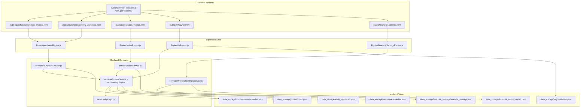

# ERP Accounting Flow

## Notes

- `purchase_invoice.html` and `general_purchase.html` now send business data only, without account selectors.
- `sales_invoice.html` keeps business-only payloads and uses the shared auth helper.
- `payroll.html` no longer asks the user to choose posting accounts manually.
- `journalService.js` is now the central accounting engine for:
  - purchase journals
  - sales journals
  - payroll posting journals
  - balance validation
  - pre-save audit snapshots
- Financial mappings are read from `financial_settings.json`, with sync back to the legacy `index.json`.
